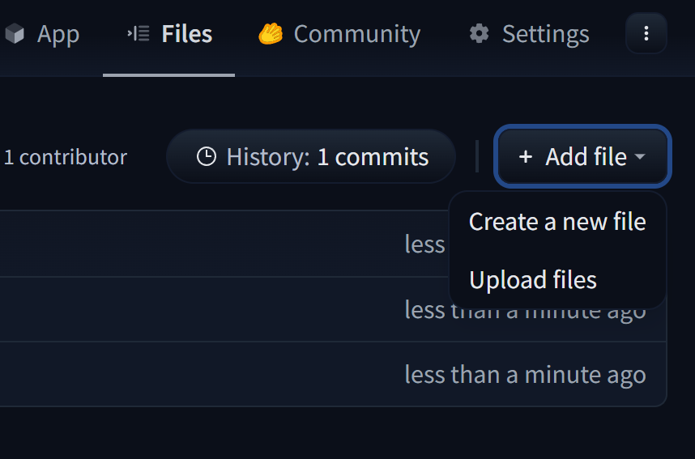
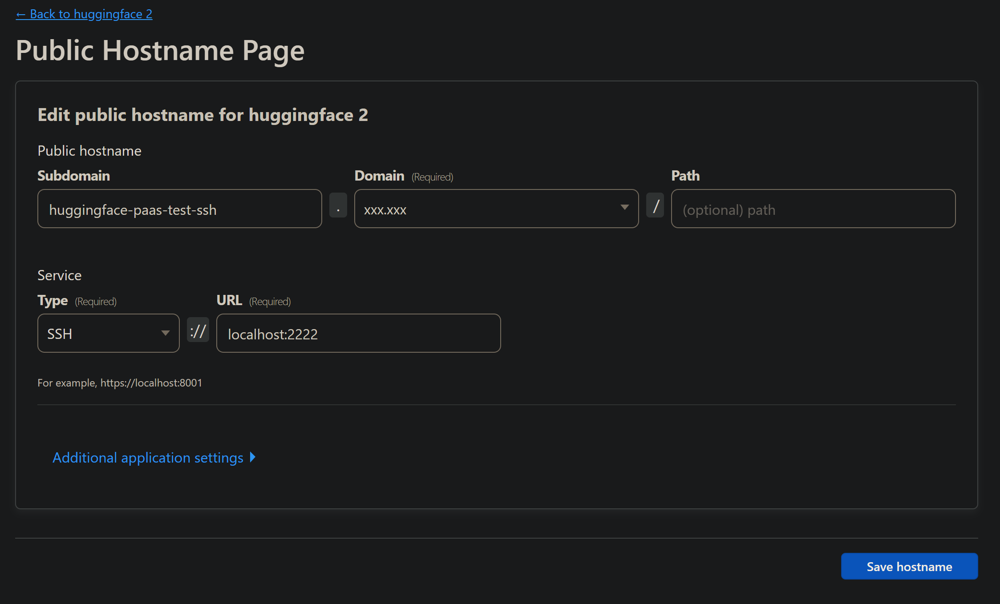

Check out the configuration reference at <https://huggingface.co/docs/hub/spaces-config-reference>

## 使用方法

下载本仓库到电脑

<https://huggingface.co/new-space> <--创建新 space


upload files



然后上传 huggingface （一定要上传本仓库所有的文件）

## huggingface 域名

用户名-(space 名空格会转换-).hf.space
例如：
abcdefg-image-and-3d-model-creator.hf.space
用户名 abcdefg
space 名 image-and-3d-model-creator

## 环境变量说明

<https://github.com/3Kmfi6HP/argo-airport-paas/tree/main#%E7%8E%AF%E5%A2%83%E5%8F%98%E9%87%8F%E8%AF%B4%E6%98%8E>

## 推荐使用 SSH

<https://github.com/3Kmfi6HP/argo-airport-paas/tree/main#%E4%BD%BF%E7%94%A8-ssh-%E8%BF%9E%E6%8E%A5%E5%AE%B9%E5%99%A8>

## 连接方法

```bash
cloudflared.exe access tcp --hostname huggingface-paas-test-ssh.xxx.xxx --listener 0.0.0.0:2223
```

## 设置图


